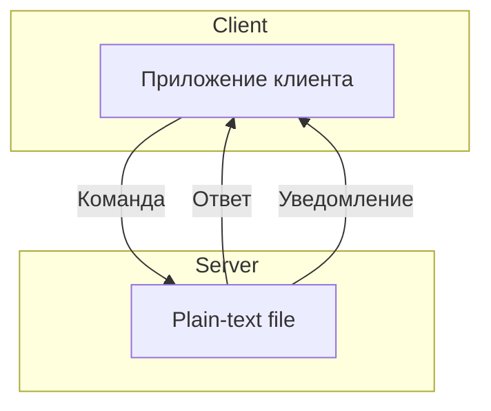

# Лабораторная работа №1 по ТППО 2022

```
Автор:
ФИО: Якимов Ярослав Дмитриевич
Группа: N42625
Факультет: БИТ
Email: yaroslav@itmo.ru
TG: @coltadmin
```

## Вариант

Вариант работы: 6 1 2 1

- **6** - Устройство: Кровать реанимационная
- **1** - Файл устройства: Plain Text
- **2** - Формата передачи данных: Binary
- **1** - Транспортный протокол: TCP

## Список файлов

- [x] README.md
- [x] tppo_server_6121.py - Приложение сервера
- [x] tppo_client_6121.py - Приложение клиента

## Схема работы



## Список аргументов сервера

- `-f | --file` - Указывает файл, который будет использоваться для хранения данных
- `-a | --address` - Указывает адрес, на котором будет запущен сервер
- `-p | --port` - Указывает порт, на котором будет запущен сервер
- `-h | --help` - Выводит список команд
- `-l | --notification-port` - Указывает порт, для уведомлений
- `-d | --debug` - Включает режим отладки

## Список аргументов клиента

- `--host` - Указывает адрес, на котором будет запущен сервер
- `-p | --port` - Указывает порт, на котором будет запущен сервер
- `-h | --help` - Выводит список команд
- `-n | --notify_port` - Указывает порт, для уведомлений

## Запуск

### Сервер

```bash
python3 tppo_server_6121.py -f data.txt -a 127.0.0.1 -p 8000 -l 8001 -d true
```

```bash
python3 tppo_server_6121.py --file data.txt --address 127.0.0.1 --port 8000 --notification-port 8001 --debug true
```

```bash
python3 tppo_server_6121.py --help
```

### Клиент

```bash
python3 tppo_client_6121.py --host 127.0.0.1 -p 8000 -n 8001
```

```bash
python3 tppo_client_6121.py --host 127.0.0.1 --port 8000 --notify_port 8001
```

```bash
python3 tppo_client_6121.py -h

```
