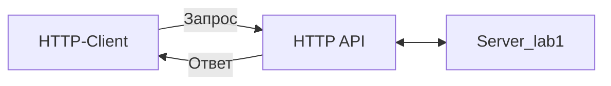

# Лабораторная работа №2 по ТППО 2022

```
Автор:
ФИО: Якимов Ярослав Дмитриевич
Группа: N42625
Факультет: БИТ
Email: yaroslav@itmo.ru
TG: @coltadmin
```

## Вариант

Вариант работы: 6 1 2 1

- **6** - Устройство: Кровать реанимационная
- **1** - Файл устройства: Plain Text
- **2** - Формата передачи данных: Binary
- **1** - Транспортный протокол: TCP

Выбранный фреймворк: **FastAPI**

## Список файлов

- [x] README.md
- [x] tppo_rest_6121.py - Приложение API для сервера
- [x] openapi.json - Файл в формате OpenAPI для документации
- [x] ../lab1/* - Файлы, содержащие классы для работы с реанимационной кроватью

## Схема работы



## Список доступных API Сервера

Список доступных API можно посмотреть, перейдя по адресу `/docs` или `/redoc`.

Также доступен файл в формате OpenAPI `openapi.json`

Там же указаны форматы успешных ответов для HTTP-запросов.

## Запуск

Запуск производится с использованием сервера приложения uvicorn.
Дополнительная информация по его аргументам запуска находится на [официальном сайте](https://www.uvicorn.org/settings/).

### Сервер

```bash
uvicorn lab2.tppo_rest_6121:app --reload --port 9000
```

## Взаимодействие

### Клиент

```http request
GET http://localhost:9000/docs

###
GET http://localhost:9000/api/v1/reanimation-bed
Accept: application/json
```


